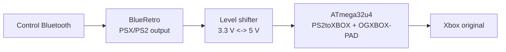

# PS2toXBOX + BlueRetro para Xbox Original

Documentación de integración, endurecimiento y puesta en marcha para usar **BlueRetro en salida PSX/PS2** como origen de entrada y un **ATmega32u4** como puente hacia **Xbox original**.

> Cadena objetivo: **Control Bluetooth -> BlueRetro -> salida PSX/PS2 -> level shifter -> Pro Micro / Leonardo / Micro -> OG Xbox**

---

## Estado del proyecto

Este repositorio documenta una variante práctica basada en el proyecto original **PS2toXBOX**, con cambios orientados a un escenario muy concreto:

- **BlueRetro** configurado como **PSX/PS2**
- **Mode = GamePad**
- **Accessories = None o Rumble**
- Firmware puente ejecutado en **ATmega32u4 16 MHz**
- Salida final como **control OG Xbox** mediante **OGXBOX-PAD**

La intención no es reemplazar el upstream, sino dejar una base **reproducible, entendible y más estable** para alguien que quiera montar exactamente esta combinación.

---

## Qué problema resuelve esta documentación

El proyecto original funciona correctamente con **mandos PS1/PS2 físicos**, pero su propio README ya advierte que, para combinarlo con **BlueRetro**, hacen falta ajustes no oficiales relacionados con **pressure buttons** y/o **rumble**.

Durante las pruebas de integración con BlueRetro se detectaron estos patrones:

- vibración residual o débil
- inputs lentos o “arrastrados” cuando se priorizan botones por presión
- microdesconexiones al mezclar lectura + rumble inestable
- entradas fantasma o activaciones espontáneas en variantes demasiado agresivas
- sensibilidad alta a la calidad eléctrica del bus PS2 (timing, pull-ups y nivel lógico)

Este paquete deja documentado qué se cambió, por qué se cambió y cuál es el firmware recomendado.

---

## Contenido del repositorio

### Firmware

- `firmware/PS2toXBOX_blueretro_hardened.ino`  
  Variante recomendada. Prioriza estabilidad, evita renegociación en caliente y minimiza inputs fantasmas.

- `firmware/PS2toXBOX_ajuste_respuesta_rapida.ino`  
  Variante alternativa orientada a una sensación de pulsación más seca. Debe probarse **solo después** de validar la variante endurecida.

### Referencia

- `upstream/PS2toXBOX_original.ino`  
  Copia del sketch base usado como referencia de auditoría.

### Documentación

- `docs/ARCHITECTURE.md`
- `docs/GETTING_STARTED.md`
- `docs/DEPENDENCIES.md`
- `docs/HARDWARE_AND_WIRING.md`
- `docs/SCHEMATICS_TEXT.md`
- `docs/BLUE_RETRO_COMPATIBILITY.md`
- `docs/MODIFICATIONS_FROM_UPSTREAM.md`
- `docs/FIRMWARE_VARIANTS.md`
- `docs/VALIDATION_PLAN.md`
- `docs/TROUBLESHOOTING.md`
- `docs/REFERENCES.md`
- `docs/AUDITORIA_TECNICA_2026-04-03.md`
- `docs/ENV_SETUP_AND_BUILD_VALIDATION.md`
- `CHANGELOG.md`

---

## Recomendación rápida para alguien nuevo

1. Revisa `docs/HARDWARE_AND_WIRING.md` antes de soldar nada.
2. Usa señales PS2 a **3.3 V** y no alimentes el lado PS2 a 5 V.
3. Usa **level shifting** si tu ATmega32u4 trabaja a 5 V.
4. Refuerza los pull-ups del lado PS2 a **1 kΩ**.
5. Configura BlueRetro en **PSX/PS2 -> GamePad**.
6. Empieza con `Accessories = None`.
7. Carga `firmware/PS2toXBOX_blueretro_hardened.ino`.
8. Valida primero botones, sticks y reconexión.
9. Activa `Accessories = Rumble` solo cuando la base esté estable.
10. Recién al final prueba la variante rápida.

---

## Filosofía de los cambios

Los cambios documentados en este repo siguen estas reglas:

- **estabilidad primero**
- **sin renegociación en caliente** de capacidades PS2
- **sticks analógicos sí**
- **botones de cara, cruceta y hombros preferentemente por ruta digital** cuando el origen es BlueRetro
- **reset del estado Xbox a neutro** al perder el enlace
- **rumble tratado como canal delicado**
- **separación entre variante estable y variante de respuesta rápida**

---

## Diagrama lógico

---

## Cuándo usar cada firmware

### Usa `PS2toXBOX_blueretro_hardened.ino`

Cuando buscas:

- máxima compatibilidad real
- menos riesgo de inputs fantasmas
- reconexión más robusta
- comportamiento predecible con BlueRetro actual

### Usa `PS2toXBOX_ajuste_respuesta_rapida.ino`

Cuando ya tienes una base estable y quieres:

- sensación de pulsación más inmediata
- menor percepción de “arrastre” en botones
- probar una respuesta más seca sin tocar el hardware

---

## Limitaciones conocidas

- BlueRetro no está ya en desarrollo activo en GitHub público; el repo quedó archivado.
- La salida **PSX/PS2** de BlueRetro es usable, pero no perfecta para todos los mandos y juegos.
- `PsxNewLib` estable no usa la línea **ACK**, por lo que el timing depende de retardos calibrados y no de handshaking real.
- El rumble en esta cadena depende de **BlueRetro**, de la negociación **PS2** y del propio sketch; por eso conviene habilitarlo al final, no al principio.

---

## Créditos y upstream

- Proyecto original: `eolvera85/PS2toXBOX`
- Librería de lectura PSX/PS2: `SukkoPera/PsxNewLib`
- Core de salida Xbox OG: `eolvera85/OGXBOX-PAD`
- Adaptador/emulación Bluetooth: `darthcloud/BlueRetro`

---
